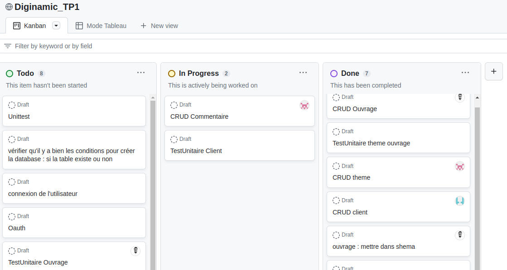

# initialisation d'un projet dans le cadre de la formation Diginamic

[ ] faire requirements config.connexion import Base

Description  
architecture dossier principaux  
installation utilisation  
Contribution

## Organisation

Utilisation du module projet de Github :

